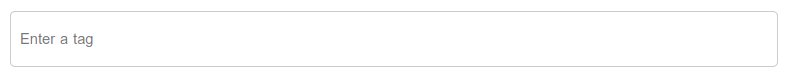
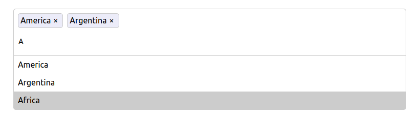

# react-autocomplete-tag

> A simple autocomplete tagging component for react app with typescript support

[](https://www.npmjs.com/package/react-autocomplete-tag) [](https://standardjs.com)

#### Screenshot 1



#### Screenshot 2



## Requirements

- react: ^16.0.0

## Features

- Autocomplete based on suggestion list
- Keyboard friendly and mouse support

## Install

```bash
npm install --save react-autocomplete-tag
```

## Usage

```tsx
import React, { useState } from 'react'

import ReactTags from 'react-autocomplete-tag' // load ReactTags component
import 'react-autocomplete-tag/dist/index.css' // load default style

const App = () => {
  const tagList: string[] = [
    'America',
    'Argentina',
    'Africa',
    'Bangladesh',
    'Burma',
    'China',
    'Chile',
    'Denmark',
    'England'
  ]

  var [tags, setTags] = useState<string[]>([])

  const [suggestions, setSuggestions] = useState<string[]>([])

  const addTag = (val: string) => {
    setTags([...tags, val])
    setSuggestions([])
  }

  const removeTag = (idx: number) => {
    var t = [...tags]
    t.splice(idx, 1)
    setTags(t)
  }

  const handleTagChange = (val: string) => {
    // in real app, suggestions could be fetched from backend

    if (val.length > 0) {
      var new_sug: string[] = []
      tagList.forEach((t) => {
        if (t.includes(val)) {
          new_sug.push(t)
        }
      })
      setSuggestions(new_sug)
    } else {
      setSuggestions([])
    }
  }

  return (
    <ReactTags
      tags={tags}
      suggestions={suggestions}
      onAddHandler={(val: string) => addTag(val)}
      onDeleteHandler={(idx: number) => removeTag(idx)}
      onChangeHandler={(val: string) => handleTagChange(val)}
    />
  )
}

export default App
```

## Options

| Option          | Type            | Default Value  | Require / Optional | Description                                                                                                                        |
| --------------- | --------------- | -------------- | ------------------ | ---------------------------------------------------------------------------------------------------------------------------------- |
| tags            | Array of String | []             | Require            | An array of tags that are displayed as pre-selected                                                                                |
| suggestions     | Array of String | []             | Require            | An array of suggestions                                                                                                            |
| placeholder     | String          | Enter a tag    | Optional           | The placeholder for tag input                                                                                                      |
| delimeters      | Array of String | ["Enter", ","] | Optional           | Specifies which characters should terminate tags input                                                                             |
| onAddHandler    | Function        | undefined      | Require            | Function called when the user wants to add a tag                                                                                   |
| onDeleteHandler | Function        | undefined      | Require            | Function called when the user deletes a tag                                                                                        |
| onChangeHandler | Function        | undefined      | Optional           | Function called when the tag input value change. You can fetch the suggestions from backend based on tag input value and update su |

## License

MIT © [joenayjoe](https://github.com/joenayjoe)
